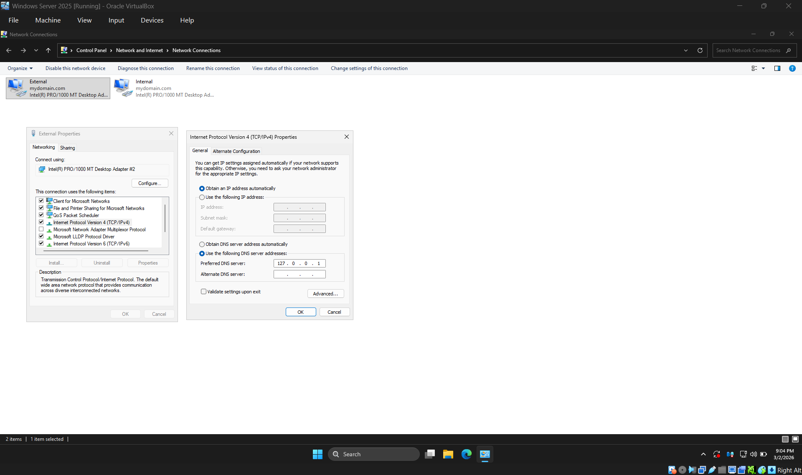
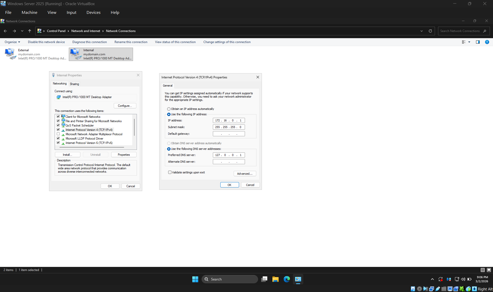
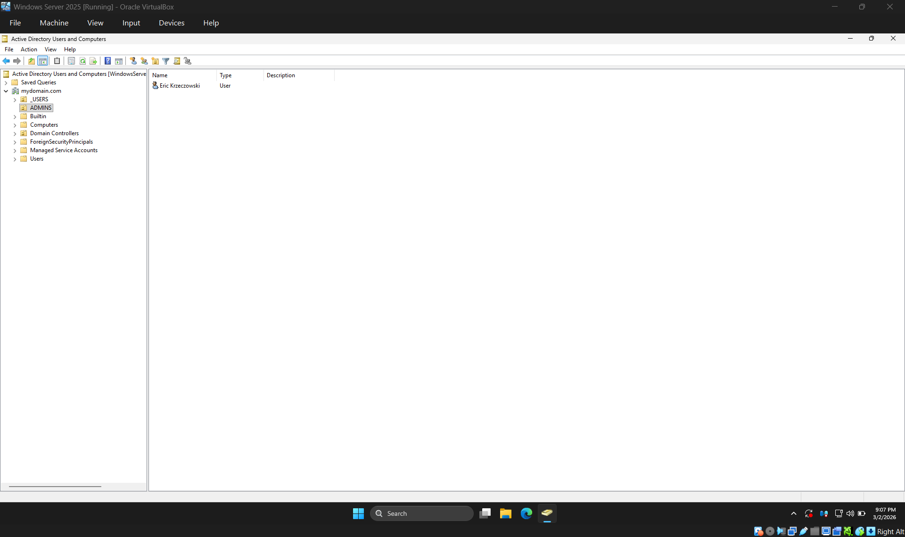
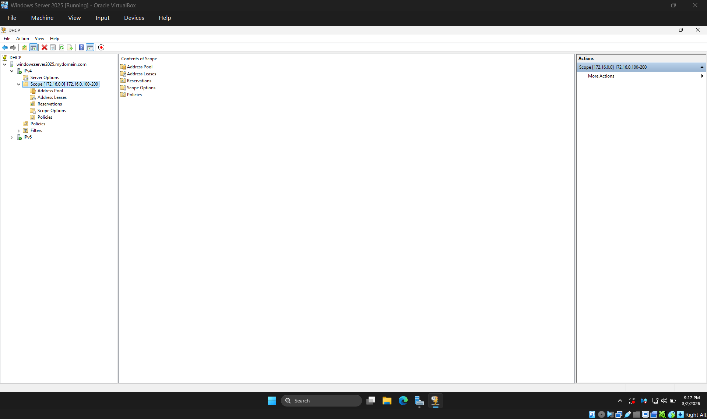
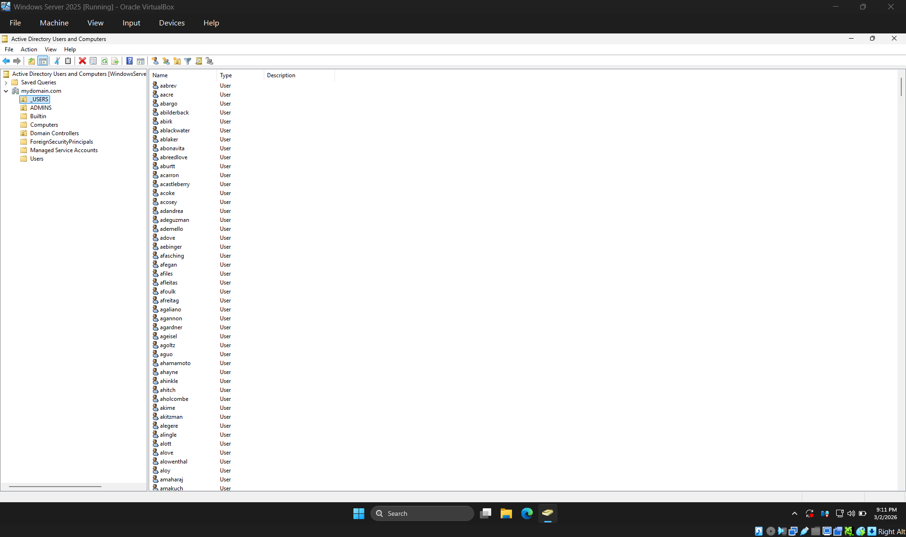
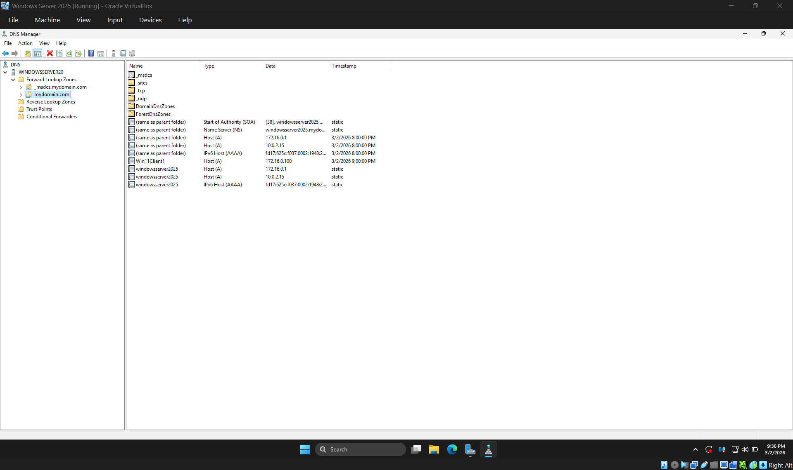
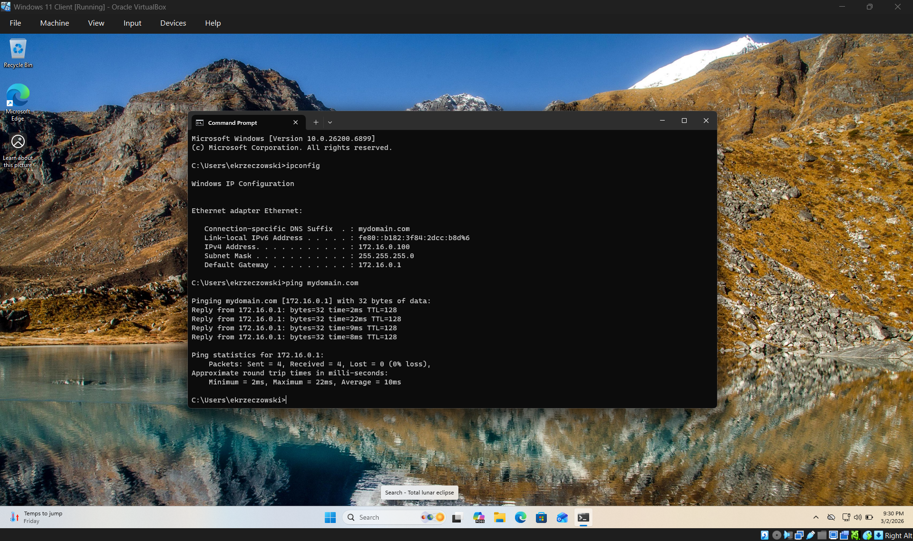
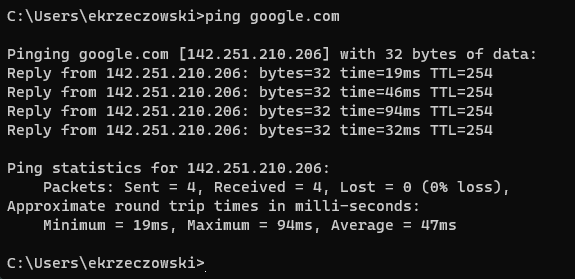
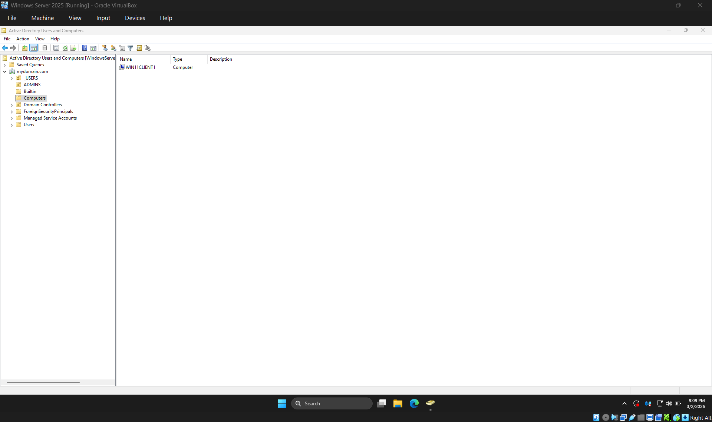
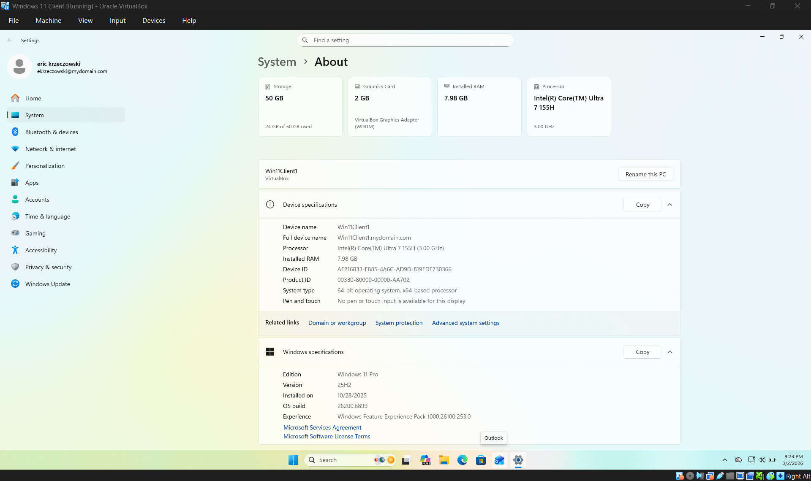

# Active Directory Home Lab — Windows Server 2025 & Windows 11

**Author:** Eric Krzeczowski  
**Date:** March 2026  
**Platform:** Oracle VirtualBox  
**Domain:** `mydomain.com`

---

## Project Summary

This project demonstrates the deployment of a fully functional Active Directory environment using Oracle VirtualBox. The lab consists of a **Windows Server 2025** domain controller (`windowsserver2025`) and a **Windows 11 Pro** client machine (`Win11Client1`) connected via an internal virtual network. The domain controller provides AD DS, DNS, DHCP, NAT/RAS, and centralized user management — simulating a small corporate network where domain-joined clients authenticate, receive IP addressing automatically, and access the internet through the DC.

**Technologies & Services Deployed:**
Active Directory Domain Services (AD DS) · DNS · DHCP · NAT / Remote Access Server (RAS) · Group Policy · PowerShell Bulk User Provisioning · Oracle VirtualBox Networking

---

## Network Architecture

```
                    ┌──────────────────────────────────────────────┐
                    │              HOME NETWORK / INTERNET         │
                    │              (NAT - Automatic DHCP)          │
                    └────────────────────┬─────────────────────────┘
                                         │
                                  NIC: "External" (NAT)
                                  (Auto IP via Home Router)
                                         │
                    ┌────────────────────┴─────────────────────────┐
                    │         DOMAIN CONTROLLER                    │
                    │         windowsserver2025.mydomain.com       │
                    │         Windows Server 2025                  │
                    │                                              │
                    │   Roles:                                     │
                    │     • AD DS    • DNS    • DHCP               │
                    │     • NAT / Remote Access Server             │
                    │                                              │
                    │   Internal NIC: 172.16.0.1/24                │
                    │   DNS: 127.0.0.1 (loopback / self)          │
                    └────────────────────┬─────────────────────────┘
                                         │
                                  NIC: "Internal" (Internal Network)
                                  (Static: 172.16.0.1/24)
                                         │
                    ┌────────────────────┴─────────────────────────┐
                    │         Win11Client1                         │
                    │         Windows 11 Pro                       │
                    │         Domain-joined: mydomain.com          │
                    │                                              │
                    │   NIC: Internal Network                      │
                    │   IP: DHCP (172.16.0.100–200 range)          │
                    │   Gateway: 172.16.0.1 (DC)                   │
                    │   DNS: 172.16.0.1 (DC)                       │
                    └──────────────────────────────────────────────┘
```

---

## Phase 1 — Virtual Machine Setup

### Domain Controller VM Configuration

| Setting             | Value                            |
|---------------------|----------------------------------|
| VM Name             | Windows Server 2025              |
| OS                  | Windows Server 2025              |
| RAM                 | 2048 MB (2 GB)                   |
| CPU Cores           | 4 (adjust based on host)         |
| Storage             | Default VDI (dynamically allocated) |
| Clipboard           | Bidirectional                    |
| Drag & Drop         | Bidirectional                    |
| NIC 1 ("External")  | NAT (internet access)            |
| NIC 2 ("Internal")  | Internal Network (client-facing) |

After creating the VM, **Windows Server 2025** was installed using the **Desktop Experience** edition to ensure GUI access. The built-in Administrator account was configured with an initial lab password.

**VirtualBox Guest Additions** were installed post-OS-setup to enable dynamic screen resolution, clipboard sharing, and improved mouse integration. The VM was fully shut down and restarted after installation to ensure Guest Additions loaded correctly.

### Client VM Configuration

| Setting             | Value                            |
|---------------------|----------------------------------|
| VM Name             | Windows 11 Client                |
| OS                  | Windows 11 Pro                   |
| RAM                 | 4096 MB (4 GB)                   |
| CPU Cores           | 4 (adjust based on host)         |
| Storage             | Default VDI (dynamically allocated) |
| Clipboard           | Bidirectional                    |
| NIC                 | Internal Network only            |

**Important:** Windows 11 **Pro** is required for domain join functionality. Windows 11 Home cannot join a domain. During setup, a local account (`user`) was created with no password — this is temporary and only used before the domain join.

---

## Phase 2 — Domain Controller Configuration

### 2.1 — Network Adapter Identification & IP Configuration

With two NICs present on the DC, each adapter was identified and renamed for clarity:

| Adapter Name | NIC Type         | IP Configuration                                   |
|-------------|------------------|-----------------------------------------------------|
| External    | NAT              | Automatic (DHCP from home router) — no config needed |
| Internal    | Internal Network | Static: see below                                    |

**Identification method:** The NAT adapter showed a valid home network IP (e.g., `10.x.x.x`). The Internal adapter showed a `169.254.x.x` APIPA address, confirming it had no DHCP source — this is the internal NIC.

**External NIC — IPv4 Configuration:**



| Field           | Value                     |
|-----------------|---------------------------|
| IP Address      | Obtain automatically      |
| DNS Server      | 127.0.0.1 (loopback)     |

**Internal NIC — Static IP Configuration:**



| Field           | Value         |
|-----------------|---------------|
| IP Address      | 172.16.0.1    |
| Subnet Mask     | 255.255.255.0 |
| Default Gateway | *(empty)*     |
| Preferred DNS   | 127.0.0.1     |

The default gateway was left blank because the DC itself serves as the gateway for the internal network. DNS was pointed to `127.0.0.1` (loopback) because Active Directory automatically installs DNS on the DC, so it resolves against itself.

### 2.2 — Server Rename

The server was renamed from its default arbitrary hostname to **windowsserver2025** via `System > Rename this PC`, then restarted.

### 2.3 — Active Directory Domain Services (AD DS) Installation

AD DS was installed via **Server Manager > Add Roles and Features > Active Directory Domain Services**.

After the role installed, the post-deployment configuration was completed:

| Setting              | Value                |
|----------------------|----------------------|
| Deployment Type      | Add a new forest     |
| Root Domain Name     | `mydomain.com`       |
| Forest/Domain Level  | Default              |
| DSRM Password        | Lab password         |

After promotion, the server automatically restarted. On the login screen, the domain prefix `MYDOMAIN\Administrator` confirmed that the domain was created successfully.

### 2.4 — Creating a Dedicated Domain Admin Account

Rather than using the built-in Administrator account, a dedicated domain admin was created:

1. Opened **Active Directory Users and Computers** (ADUC).
2. Created a new **Organizational Unit** named `_ADMINS` under `mydomain.com`.
3. Created a new user inside `_ADMINS`:

| Field            | Value                          |
|------------------|--------------------------------|
| Full Name        | Eric Krzeczowski               |
| Logon Name       | `ekrzeczowski`                 |
| Password         | Lab password                   |
| Password Expires | Never (lab environment only)   |

4. Added the user to the **Domain Admins** security group via `Properties > Member Of > Add > Domain Admins`.



After signing out, the DC was logged into using the new `ekrzeczowski` domain admin account.

### 2.5 — NAT / Remote Access Server (RAS) Configuration

NAT was configured to allow internal clients to access the internet through the DC's external NIC.

1. Installed the **Remote Access** role via Server Manager, selecting the **Routing** role service.
2. Opened **Routing and Remote Access** from Tools.
3. Configured and enabled the service, selecting **NAT** as the configuration type.
4. Selected the **External** adapter as the public interface for internet connectivity.

After configuration, the Routing and Remote Access console showed a green status indicator confirming the service was running.

### 2.6 — DHCP Server Configuration

The DHCP role was installed and configured to provide automatic IP addressing to internal clients.



**DHCP Scope:**

| Setting          | Value                                    |
|------------------|------------------------------------------|
| Scope Name       | 172.16.0.100-200                         |
| Start Address    | 172.16.0.100                             |
| End Address      | 172.16.0.200                             |
| Subnet Mask      | 255.255.255.0 (/24)                      |
| Exclusions       | None                                     |
| Lease Duration   | 8 days (default)                         |
| Default Gateway  | 172.16.0.1 (DC internal)                 |
| DNS Server       | 172.16.0.1 (DC)                          |

The scope was activated, and the DHCP server was authorized in Active Directory. The default gateway was configured under **Server Options > Router** pointing to `172.16.0.1`.

### 2.7 — Bulk User Provisioning via PowerShell

Over 1,000 user accounts were created programmatically using a PowerShell script:

**Script logic overview:**

```powershell
# Variables
$PASSWORD_FOR_USERS = "Password1"
$USER_FIRST_LAST_LIST = Get-Content .\names.txt

# Convert password to secure string
$password = ConvertTo-SecureString $PASSWORD_FOR_USERS -AsPlainText -Force

# Create the _USERS OU
New-ADOrganizationalUnit -Name _USERS -ProtectedFromAccidentalDeletion $false

# Loop through each name and create AD user
foreach ($n in $USER_FIRST_LAST_LIST) {
    $first = $n.Split(" ")[0].ToLower()
    $last = $n.Split(" ")[1].ToLower()
    $username = "$($first.Substring(0,1))$($last)".ToLower()

    New-ADUser -SamAccountName $username `
               -UserPrincipalName "$username@mydomain.com" `
               -Name "$first $last" `
               -GivenName $first `
               -Surname $last `
               -DisplayName "$first $last" `
               -AccountPassword $password `
               -PasswordNeverExpires $true `
               -Path "OU=_USERS,DC=mydomain,DC=com" `
               -Enabled $true
}
```

**What the script does:**

1. Reads a text file (`names.txt`) containing ~1,000 randomized full names (one per line), plus my own name added at the top.
2. Converts the plaintext lab password into a PowerShell `SecureString` object.
3. Creates a new OU called `_USERS` to hold the generated accounts.
4. Iterates through every name, splits each into first/last, generates a username using first-initial + last-name convention (e.g., `Eric Krzeczowski` → `ekrzeczowski`), and creates the AD user account with all relevant attributes.

**Pre-requisite:** Before running the script, the execution policy was set to allow unsigned scripts:

```powershell
Set-ExecutionPolicy Unrestricted
```

After execution, all user accounts were visible in ADUC under the `_USERS` OU, and searchable via the ADUC Find function.



---

## Phase 3 — DNS Verification

After AD DS installation and client domain join, the **DNS Manager** was used to verify that all DNS records were properly registered.



The Forward Lookup Zone for `mydomain.com` contained the following key records:

| Record Name         | Type        | Data            | Notes                              |
|---------------------|-------------|-----------------|------------------------------------|
| (same as parent)    | SOA         | windowsserver2025... | Start of Authority for the zone |
| (same as parent)    | NS          | windowsserver2025... | Name Server record              |
| (same as parent)    | Host (A)    | 172.16.0.1      | DC internal IP                     |
| (same as parent)    | Host (A)    | 10.0.2.15       | DC external NAT IP                 |
| Win11Client1        | Host (A)    | 172.16.0.100    | Client — dynamically registered    |
| windowsserver2025   | Host (A)    | 172.16.0.1      | DC static record                   |
| windowsserver2025   | Host (A)    | 10.0.2.15       | DC NAT adapter record              |

The presence of the `Win11Client1` A record (172.16.0.100) confirms that the client successfully registered itself in DNS after joining the domain — a key indicator that AD-integrated DNS is functioning correctly.

---

## Phase 4 — Client Machine Domain Join

### 4.1 — Network Verification

After booting the Windows 11 client, network connectivity was verified:



```
C:\Users\ekrzeczowski> ipconfig

Ethernet adapter Ethernet:

   Connection-specific DNS Suffix  . : mydomain.com
   Link-local IPv6 Address . . . . . : fe80::b182:3f84:2dcc:b8d%6
   IPv4 Address. . . . . . . . . . . : 172.16.0.100
   Subnet Mask . . . . . . . . . . . : 255.255.255.0
   Default Gateway . . . . . . . . . : 172.16.0.1

C:\Users\ekrzeczowski> ping mydomain.com

Pinging mydomain.com [172.16.0.1] with 32 bytes of data:
Reply from 172.16.0.1: bytes=32 time=2ms TTL=128
Reply from 172.16.0.1: bytes=32 time=22ms TTL=128
Reply from 172.16.0.1: bytes=32 time=9ms TTL=128
Reply from 172.16.0.1: bytes=32 time=8ms TTL=128
```

Successful DNS resolution of `mydomain.com` to `172.16.0.1` confirmed the DNS server was working. The DHCP-assigned address (`172.16.0.100`) and gateway (`172.16.0.1`) matched the configured scope.

**Internet connectivity** was verified by pinging an external host:



```
C:\Users\ekrzeczowski> ping google.com

Pinging google.com [142.251.210.206] with 32 bytes of data:
Reply from 142.251.210.206: bytes=32 time=19ms TTL=254
Reply from 142.251.210.206: bytes=32 time=46ms TTL=254
Reply from 142.251.210.206: bytes=32 time=94ms TTL=254
Reply from 142.251.210.206: bytes=32 time=32ms TTL=254
```

Successful DNS resolution and ping replies to `google.com` confirmed the full NAT/routing infrastructure was operational — traffic was flowing from the client through the DC's internal NIC, across NAT, and out to the internet.

### 4.2 — Domain Join & Rename

The client was simultaneously renamed and joined to the domain:

1. Right-clicked Start > **System** > **Rename this PC (advanced)** > **Change**.
2. Set computer name to **Win11Client1**.
3. Selected **Domain** and entered `mydomain.com`.
4. Authenticated with domain credentials when prompted.
5. Restarted the machine.

After restart, the login screen showed `Sign in to: MYDOMAIN`, confirming the domain join was successful. The computer object appeared in ADUC under the **Computers** container.



### 4.3 — Domain Account Login Verification

On the Win11Client1 login screen, **Other user** was selected and a domain account was used to sign in. Login succeeded and a new user profile was created on the client.



The System > About page confirms:

| Field               | Value                                      |
|---------------------|--------------------------------------------|
| Signed-in User      | ekrzeczowski@mydomain.com                  |
| Device Name         | Win11Client1                               |
| Full Device Name    | Win11Client1.mydomain.com                  |
| Edition             | Windows 11 Pro                             |
| Processor           | Intel Core Ultra 7 155H (3.00 GHz)         |
| Installed RAM       | 7.98 GB                                    |

---

## Troubleshooting Notes

**Issue: Client received IP address but no default gateway.**  
After initially configuring DHCP, the client obtained an IP from the scope but `ipconfig` showed no default gateway. The root cause was a missing **Router** entry in the DHCP Server Options. After adding `172.16.0.1` as the router under Server Options and restarting the DHCP service, running `ipconfig /renew` on the client resolved the issue.

**Issue: Routing and Remote Access failed to show NICs on first configuration attempt.**  
The RAS configuration wizard occasionally fails to enumerate NICs on the first attempt. Closing and reopening the Routing and Remote Access console, then re-running the wizard, resolved the issue.

---

## Skills Demonstrated

- **Windows Server Administration** — Installed and configured Windows Server 2025 with multiple roles and features.
- **Active Directory Domain Services** — Deployed a new forest, created OUs, users, security groups, and managed domain admin accounts.
- **DNS** — Configured AD-integrated DNS for internal name resolution; verified forward lookup zone records and dynamic client registration.
- **DHCP** — Configured scopes, leases, server options (gateway, DNS), and verified address distribution.
- **NAT / Routing** — Enabled internal clients to route traffic through the DC to the internet using RAS/NAT.
- **PowerShell Automation** — Used PowerShell to bulk-create 1,000+ user accounts from a script, demonstrating automation of repetitive administrative tasks.
- **Network Troubleshooting** — Diagnosed and resolved DHCP gateway and RAS configuration issues using `ipconfig`, `ping`, and service-level inspection.
- **Virtualization** — Built and configured multi-VM environments in Oracle VirtualBox with segmented internal networking.
- **Domain Join Process** — Joined a Windows 11 Pro client to the domain, verified authentication, and confirmed centralized identity management.

---

## Environment Specifications

| Component           | Details                                    |
|---------------------|--------------------------------------------|
| Hypervisor          | Oracle VirtualBox (+ Extension Pack)       |
| Domain Controller   | Windows Server 2025 (Desktop Experience)   |
| DC Hostname         | windowsserver2025                          |
| Client OS           | Windows 11 Pro                             |
| Client Hostname     | Win11Client1                               |
| Domain Name         | mydomain.com                               |
| Internal Subnet     | 172.16.0.0/24                              |
| DHCP Range          | 172.16.0.100 – 172.16.0.200               |
| DC Internal IP      | 172.16.0.1                                 |
| DC DNS              | 127.0.0.1 (self / loopback)               |
| Admin Account       | ekrzeczowski (Domain Admins)               |
| User Convention     | First initial + last name                  |
| Network Topology    | NAT (external) + Internal Network (VBox)   |
